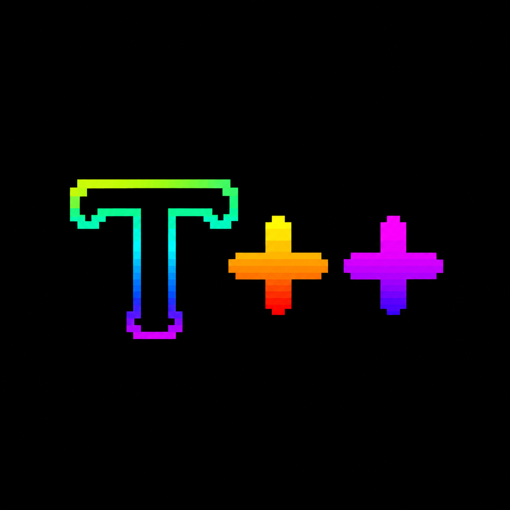

<p align="center">
    
</p>


# Term++

Term++ is a small terminal/shell project written in C++.

It's mainly a **hands-on self-learning hobby project** I'm making to learn C++ in a more fun way. Instead of only following tutorials and writing small exercises, I'm learning by actually building something I can use and improve over time.

## What is it?

Term++ is a simple command-line environment with its own commands and functionality.

It's still a work in progress, and the project will probably change quite a lot as I learn more C++.

Some of the things currently implemented include:

* `ls`
* `cd`
* `mkdir`
* `pwd`
* `touch`
* `cat`
* Basic command and argument handling

## Why?

The main goal isn't to create the next big terminal.

I made Term++ so I can learn C++ by actually **doing things with it**.

As I learn new concepts, I try to use them in the project, which makes the learning process a lot more interesting than just following examples.

## Current version

**v0.0.5**

The project is still in early development, so expect things to change.

## Building

Term++ is written in C++ and uses the standard library.

To build it with `g++`:

```bash
g++ *.cpp -o term++
```

Then run:

```bash
./term++
```

## Note

This is a hobby/learning project. The code isn't meant to be perfect — improving it and learning from mistakes is part of the point.
