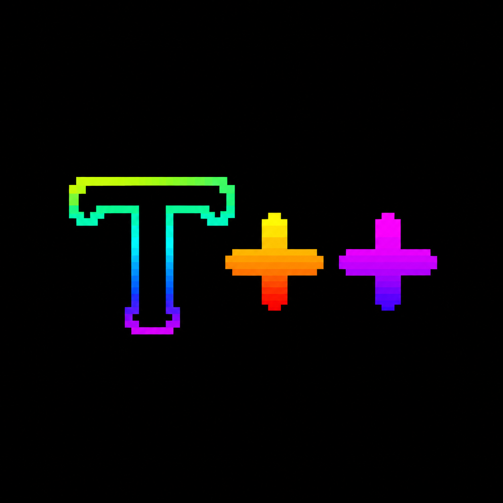

<p align="center">
    
</p>

# Term++

Term++ is a small terminal/shell project written in C++.

It's mainly a **hands-on self-learning hobby project** I'm making to learn C++ in a more practical and fun way. Instead of only following tutorials and writing small exercises, I'm learning by actually building something I can use, break, fix, and improve over time.

## What is it?

Term++ is a simple command-line environment with its own commands and functionality.

The project started out very small, but has gradually grown as I've learned more C++. I'm using it to experiment with things like command parsing, arguments, filesystem operations, and how a shell actually works underneath.

Some of the currently implemented commands include:

* `ls`
* `cd`
* `mkdir`
* `pwd`
* `touch`
* `cat`
* `rm`
* `help`
* `version`
* `hello`
* `clear`
* `exit`

It also has basic command and argument handling, along with support for flags on commands such as `rm`.

The project is still a work in progress, so the structure and functionality will continue to change as I learn.

## Why?

The main goal isn't to create the next big terminal.

I made Term++ so I can learn C++ by actually **doing things with it**.

As I learn new concepts, I try to use them in the project. When something breaks, I try to understand why, fix it, and keep going.

That's what makes the project useful to me: I'm not trying to make perfect code from the beginning. I'm learning by building it.

## Current version

**v0.0.6**

Term++ is still in early development. Things may change, break, get rewritten, or disappear as the project evolves.

## Building

Term++ uses **CMake** as its build system.

To configure the project:

```bash
cmake -S . -B build
```

Then build it with:

```bash
cmake --build build
```

After building, run the generated executable:

```bash
./build/term++
```

### Windows

Term++ can also be cross-compiled for Windows using a MinGW-w64 toolchain.

A separate CMake build directory can be used for the Windows build so the Linux and Windows builds stay independent.

## Note

This is a hobby/learning project. The code isn't meant to be perfect — improving it, breaking it, fixing it, and learning from mistakes is part of the point.

I'm building Term++ primarily to learn C++, not to compete with existing shells or terminals.
